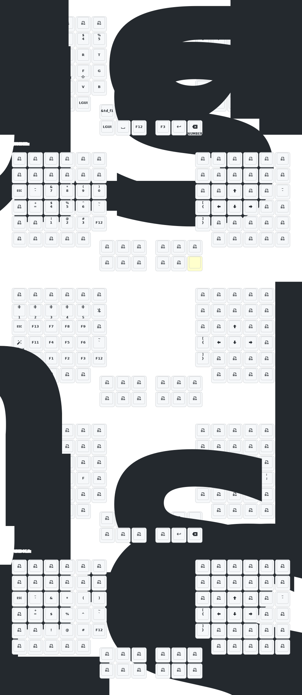

# Cyboard Imprint Dongle Firmware

ZMK firmware for the [Cyboard Imprint](https://docs.cyboard.digital/) split keyboard with a **USB dongle central**. The dongle connects to the host via USB and communicates with both keyboard halves over BLE.

## Architecture

```
                          BLE
[Left Half] ◄────────────────────────► [Dongle] ◄──── USB ────► [PC]
 assimilator-bt                         nRF52840
 PMW3610 trackball (scroll)             SH1106 OLED
 WS2812 RGB underglow                   Mock kscan (no keys)

                          BLE
[Right Half] ◄───────────────────────► [Dongle]
 assimilator-bt
 PMW3610 trackball (cursor)
 WS2812 RGB underglow
```

- **Dongle** (`nice_nano`): BLE central + USB HID. Receives key matrix + dual trackball data from both halves, outputs to host. Has an SH1106 128x64 OLED display.
- **Left half** (`assimilator-bt`): BLE peripheral. PMW3610 trackball configured as scroll wheel. WS2812 RGB underglow (150 LEDs).
- **Right half** (`assimilator-bt`): BLE peripheral. PMW3610 trackball configured as mouse cursor. WS2812 RGB underglow (150 LEDs).

### Dual Trackball Forwarding

Each half forwards its trackball data to the dongle over a dedicated BLE `input-split` channel:

| Channel | Source | Dongle Listener | Function |
|---------|--------|-----------------|----------|
| 0 | Left PMW3610 | `trackball_central_listener` | Scroll (via keymap input processors) |
| 1 | Right PMW3610 | `trackball_peripheral_listener` | Mouse cursor |

## Keymap

Using the `imprint_function_row_full_bottom_row` matrix transform (82 keys).

### Layers

| # | Name | Description |
|---|------|-------------|
| 0 | Default | QWERTY with function row, modifiers, and layer toggles |
| 1 | Numpad/Nav | Left: numpad (7-8-9 / 4-5-6 / 1-2-3 / 0), Right: arrow keys + Home/End |
| 2 | Keyboard Control | BT profile select, RGB underglow controls, sys_reset, bootloader |
| 3 | Auto Mouse | Mouse buttons (LCLK, MCLK, RCLK) on left home row |
| 4 | Factory Test | All keys output numbers (diagnostics) |

### Keymap Visualization



## Building

Firmware builds automatically via GitHub Actions on every push. Download artifacts from the [latest successful run](../../actions/workflows/build.yml).

### Build Matrix

| Artifact | Board | Shield | Description |
|----------|-------|--------|-------------|
| `imprint_dongle` | `nice_nano` | `imprint_dongle` | Dongle central (USB + OLED) |
| `imprint_dongle_left` | `assimilator-bt` | `imprint_dongle_left` | Left peripheral |
| `imprint_dongle_right` | `assimilator-bt` | `imprint_dongle_right` | Right peripheral |
| `settings_reset_dongle` | `nice_nano` | `settings_reset` | Bond clearing for dongle |
| `imprint_left` | `assimilator-bt` | `imprint_left` | Fallback: original non-dongle left |
| `imprint_right` | `assimilator-bt` | `imprint_right` | Fallback: original non-dongle right |

## Flashing

### Initial Setup (First Time)

1. **Clear bonds on dongle**: Flash `settings_reset_dongle.uf2` to the dongle via USB
2. **Flash dongle firmware**: Flash `imprint_dongle.uf2` to the dongle
3. **Clear bonds on halves**: On each half, use `&bt BT_CLR_ALL` from the Keyboard Control layer (Layer 2), or flash the original `settings_reset` UF2 if available
4. **Flash left half**: Flash `imprint_dongle_left.uf2` via USB bootloader
5. **Flash right half**: Flash `imprint_dongle_right.uf2` via USB bootloader
6. **Pair**: Power cycle all three devices. They should auto-pair.

### Entering Bootloader

- **Dongle**: Double-tap the reset button (or use `&bootloader` from Layer 2)
- **Keyboard halves**: Double-tap the reset button on the assimilator-bt PCB

### Troubleshooting Pairing

If halves don't connect to the dongle:

1. Flash `settings_reset_dongle.uf2` to the dongle
2. Use `&bt BT_CLR_ALL` on both halves (Layer 2 has BT controls)
3. Re-flash the dongle firmware
4. Power cycle all devices

## File Structure

```
boards/shields/imprint_dongle/
├── Kconfig.shield              # Shield symbol definitions (3 variants)
├── Kconfig.defconfig           # Feature flags, display config, RGB, trackball
├── imprint_dongle.dtsi         # Shared: 14 matrix transforms, kscan, dual input-splits
├── imprint_dongle.overlay      # Dongle: mock kscan, OLED display (SH1106 I2C)
├── imprint_dongle_left.overlay # Left: row GPIOs, PMW3610, input-split channel 0
├── imprint_dongle_right.overlay# Right: row GPIOs + offsets, PMW3610, input-split channel 1
└── boards/
    └── assimilator-bt.overlay  # SPI pinctrl for trackball + WS2812 LEDs

config/
├── imprint_dongle.conf         # Base conf (all 3 builds): TX power, RGB off, display on
├── imprint_dongle_left.conf    # Left: RGB on, display off
├── imprint_dongle_right.conf   # Right: RGB on, display off
├── imprint_dongle.keymap       # Keymap (shared by all 3 builds)
├── imprint_dongle.json         # Physical layout for keymap-drawer
└── west.yml                    # West manifest (ZMK + Cyboard module)

keymap-drawer/
├── imprint_dongle.svg          # Auto-generated keymap visualization
└── imprint_dongle.yaml         # Parsed keymap (intermediate format)

keymap_drawer.config.yaml       # Keymap-drawer rendering config
```

## Dongle Hardware

The dongle is a custom nRF52840 board that is electrically equivalent to a nice!nano v2 + SH1106 OLED display on a smaller custom PCB. It uses the `nice_nano` board definition in ZMK (Zephyr 4.1 defaults to rev 2.0.0).

### OLED Display

- **Controller**: SH1106 (128x64, I2C address 0x3C)
- **I2C pins**: SDA = P0.17, SCL = P0.20 (standard nice_nano I2C0)
- **Shows**: Active layer, BLE connection status, battery levels (fetched from peripherals)

If your dongle has a different display (e.g., SSD1306 128x32), edit the display node in `imprint_dongle.overlay`.

## Modifying the Keymap

1. Edit `config/imprint_dongle.keymap`
2. Push to GitHub
3. GitHub Actions will rebuild firmware AND regenerate the keymap SVG
4. Download new artifacts from the Actions tab

## References

- [ZMK Dongle Documentation](https://zmk.dev/docs/development/hardware-integration/dongle)
- [Cyboard Imprint Docs](https://docs.cyboard.digital/)
- [zmk-corne-dongle](https://github.com/david-lai-jpg/zmk-corne-dongle) (reference implementation)
- [keymap-drawer](https://github.com/caksoylar/keymap-drawer) (keymap visualization)
